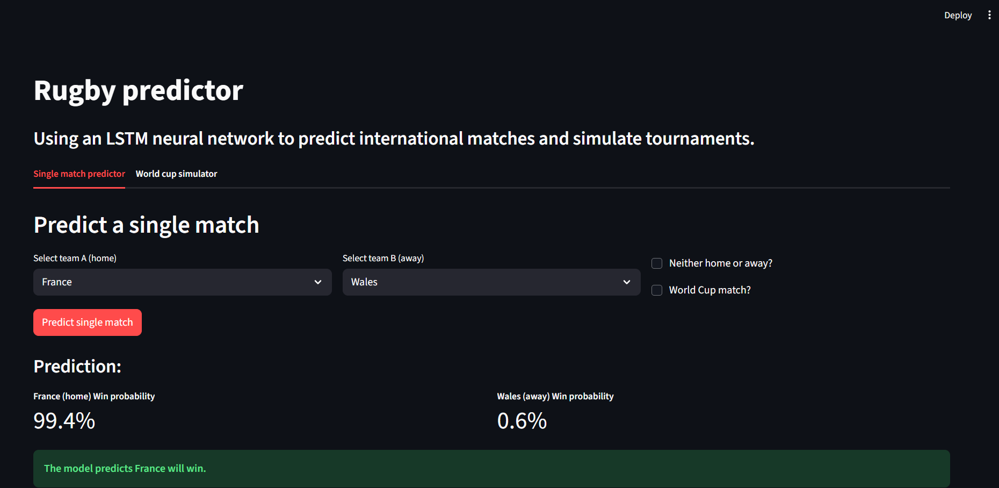
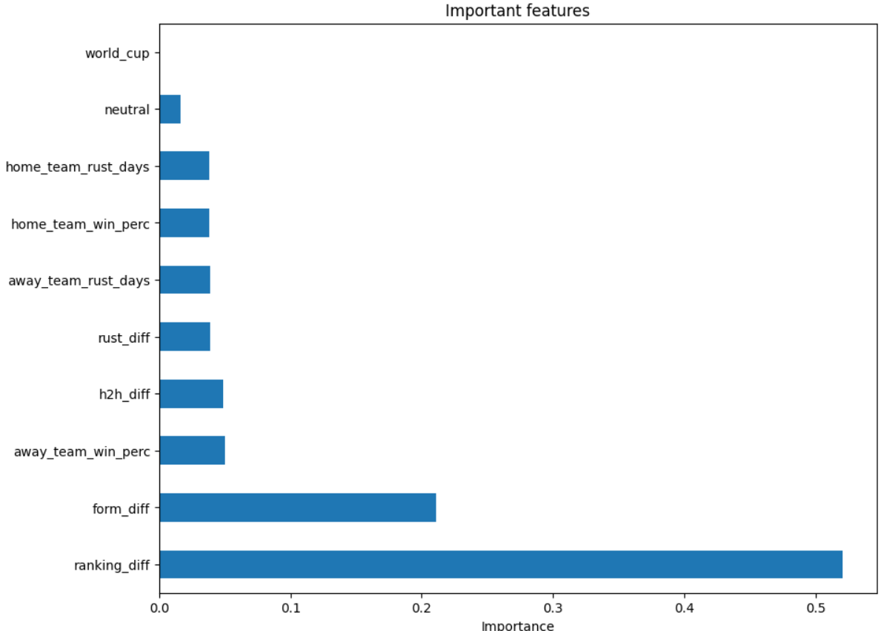

# Rugby AI predictor & RWC simulator


**Click here!:** [**Live app**](https://rugby-predictor-z3qs7wkz5cm4wug9glmd26.streamlit.app/)

This is a machine learning project that predicts international rugby match outcomes and simulates the entire Rugby World cup.

This project competes XGBoost against a custom built TensorFlow keras LSTM neural network, which proved more accurate.



### The goal

The goal was to build a complete end to end AI product, doing the following:

1.  **Complex data engineering:** Handling and merging multiple messy, time series datasets.
2.  **Deep feature engineering:** Creating predictive features from raw data.
3.  **Model benchmarking:** Comparing XGBoost against a Deep Learning LSTM model.
4.  **The app:** Building an app that can handle real world errors, like missing data for tier 2 teams.
5.  **Full deployment:** Saving the final model and scaler, building a full Streamlit UI, and deploying it to the cloud.


### Tech stack

* **Language:** Python
* **Modeling:** TensorFlow Keras, XGBoost, scikit-learn
* **Data manipulation:** pandas, numpy
* **Web app and deployment:** Streamlit, Streamlit community cloud
* **Model saving:** joblib

### The pipeline:

Building this model required a data engineering and feature engineering pipeline.

#### 1. Data cleaning
The raw results.csv dataset went back to 1871. I immediately spotted that early scores (1-0) were not points in the modern era, making them useless for prediction.
I made the decision to filter the dataset to the modern 5 point try Era (1992-present) to ensure all data was accurate and relevant.

#### 2. Data engineering
The project required two separate time series datasets: match results and historical rankings.
* **pd.melt:** The rankings data was in a "wide" format (one column for each team). I unpivoted it into a "long" format using pd.melt.
* **pd.merge_asof:** To join the two, I used pd.merge_asof to join the most recent ranking to each match as of the day it was played, perfectly simulating a real-world scenario with no data leakage.

#### 3. Feature engineering
The model's 94.12% accuracy comes from these engineered features, which give the model critical context:
* **ranking_diff:** The difference in world rugby ranking points.
* **form_diff:** The difference in the teams 10-game rolling win percentage.
* **h2h_diff:** The difference in their all time head to head win percentage against each other.
* **rust_diff:** To measure the difference in days since last played, penalizing teams that are rusty.
* **Boolean Features:** neutral (is it a neutral venue?) and world_cup (is it a wc match?) converted to ints.

#### 4. Robustness
The RWC simulator includes tier 2 teams that were not in our tier 1 training data.
* **Solution:** I made is so the app detects these teams, catches the IndexError, and imputes a default tier 2 profile (a realistic 65.0 ranking points, 50% form etc). This prevents the app from crashing and allows for a full, realistic simulation.

### Model benchmarking: XGBoost vs LSTM

I benchmarked XGBoost against an LSTM neural network on a 20% future test set (289 matches). The LSTM was the clear champion.

# Accuracy
LSTM -> 94.12%
XGBoost -> 91.35% 

The XGBoost model confirmed our feature engineering was successful. The ranking_diff was, by far, the most important feature.




### How to run this project locally

1.  **Clone the repository:**
    ```bash
    git clone https://github.com/MarcusHanmer1/rugby-predictor.git
    cd rugby-predictor
    ```

2.  **Create and activate a virtual environment:**
    ```bash
    python -m venv venv
    source venv/bin/activate or venv/Scripts/activate (depending on os)
    ```

3.  **Install all dependencies:**
    *This will take a few minutes as it includes TensorFlow.*
    ```bash
    pip install -r requirements.txt
    ```

4.  **Run the Streamlit app:**
    ```bash
    streamlit run app.py
    ```
    Your app will open in your browser
